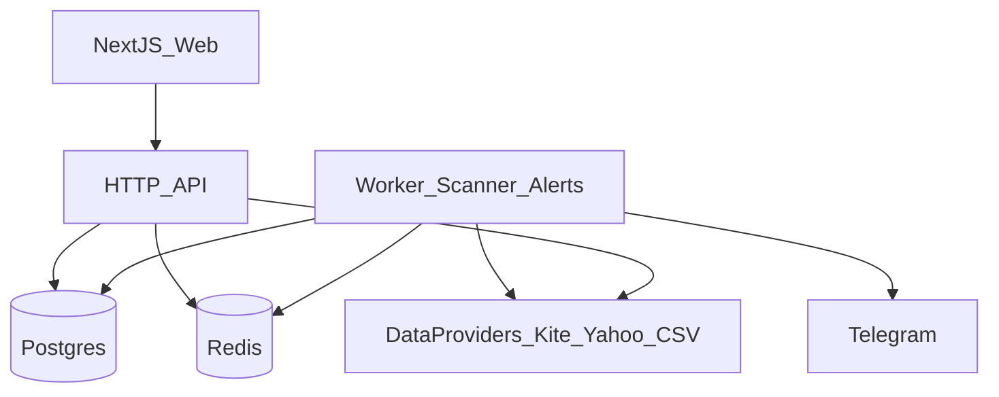

# SignalSky Full MVP Plan (Daily candles, API-first, India+US, Auth+PhonePe)

## Product scope (MVP)

- **Daily candles only** (EOD signals)
- **Markets**: India + US
- **Core strategy**: Reset & Reclaim (SMA200 + ATH station rule + optional volume surge)
- **Features**:
  - Signal scanner table + heat buckets
  - Signal detail with **explainability** + **position size calculator**
  - **Backtest summary** per symbol/signal (free limited, Pro unlimited)
  - Manual trade journal + system exit alerts (SMA200 exit)
  - Market Health Index (Traffic Light)
  - Watchlists (pre-reset / reset / reclaiming)
  - Telegram alerts (Pro real-time-ish EOD; Free delayed)
- **Monetization**: Free vs Pro (and later Institutional)

## Key assumptions (locked)

- **Signal evaluation time**: after market close using the day’s **Close**
- **Backtest pricing**: **close-to-close** (entry at signal close, exit at exit close) and clearly labeled as theoretical
- **Journal ingestion**: manual trades only for MVP
- **No NSE scraping**
- **Scan cadence (daily strategy)**:
  - **Early warnings**: ~30 minutes after market open, and ~1 hour before market close
  - **Confirmation**: after market close (this is the official signal used for backtests)

## Recommended architecture (mobile-ready)

### High-level components

- **Web app** (Next.js, existing repo): UI only
- **HTTP API** (Node/TypeScript): stable contract for web + mobile
- **Worker** (Node/TypeScript): scheduled scans, backtests, Telegram deliveries
- **Postgres**: users, subscriptions, universes, signals, backtest snapshots, journal
- **Redis**: BullMQ queues + caching computed snapshots

### Repo structure (monorepo)

- `apps/web/` (your current Next.js app; may need moving current code under this)
- `apps/api/` (Fastify/Nest HTTP server)
- `apps/worker/` (BullMQ workers + schedulers)
- `packages/core/` (shared strategy engine, indicators, data contracts, adapters)
- `packages/db/` (ORM schema + migrations)

If you prefer minimal repo churn, we can also keep Next.js at root and add `apps/api`, `apps/worker`, `packages/*`.

## Tech choices (concrete)

- **API framework**: Fastify + Zod (fast, simple)
- **ORM**: Prisma (fast to ship, great migrations)
- **Auth**: NextAuth (Auth.js) with Google + email magic link (optional)
- **Billing**: PhonePe (India-first) with webhook-based entitlement updates
- **Queues**: BullMQ

## India-first pricing + lifetime offer (conversion-focused)

### Currency & price presentation

- **All public pricing is shown in INR (₹)** on:
  - Landing page pricing section
  - Dedicated pricing page
- Use **anchor pricing psychology**:
  - Show an “MRP” (higher price) in strikethrough
  - Show the current discounted price as the primary figure
  - Copy examples: “Limited-time early adopter pricing”, “Price increases after launch”

### Plans (MVP)

- **Free**: ₹0
- **Pro Monthly**: low entry price to accelerate adoption (exact ₹ number TBD)
- **Pro Yearly**: discounted relative to monthly (“2 months free” framing; exact ₹ number TBD)
- **Lifetime (first 100 customers)**:
  - One-time payment (exact ₹ number TBD)
  - Grants Pro access permanently (entitlement-based)
  - **Scarcity UI** on landing + pricing: show “Only 100 seats” and “X spots left”

### “Spots left” (how it’s computed)

- Spots left must be **server-authoritative** (not hardcoded in the UI).
- Implementation approach:
  - Keep a DB record for the lifetime deal cap (100) and count **confirmed** lifetime purchases
  - Expose a public endpoint: `GET /api/deals/lifetime` → `{ cap: 100, sold: n, remaining: cap-n }`
  - Decrement sold only when PhonePe confirms payment success via webhook

## Data strategy (India+US)

### Data sources (pluggable)

- **India (NSE) adapter (MVP default)**: Zerodha **Kite Connect** via **service account** for automated 10-year backfill + daily updates (no scraping)
- **US adapter (MVP default)**: Yahoo Finance (free-ish) for daily OHLCV history + latest close
- **CSV upload adapter (fallback)**: admin uploads India CSVs if API access is unavailable

### India (CSV-first) — day 1 scope

- **Universes supported day 1**: **NIFTY 50** (expand later to Next 50 / Bank / sectoral / etc.)
- **Constituents ingestion**:
  - Admin uploads a CSV that lists NIFTY 50 constituents (symbol + name; optional sector)
  - Stored as universe membership in DB
- **Daily bars ingestion**:
  - Admin uploads daily OHLCV CSVs (historical once, then incremental)
  - Stored in `DailyBar` and used for indicators, scanning, and backtests
- **Important**: we intentionally avoid scraping NSE webpages for ToS/reliability reasons

### India (Kite Connect via service account) — operational notes

- Use a single **service account** to fetch NSE data for scanning/backtests (not per-user broker connects).
- Maintain an **instrument master** mapping (instrument token ↔ tradingsymbol) from Kite’s instruments list, refreshed daily.
- Data jobs:
  - **Backfill**: fetch ~10 years of `day` candles per instrument and store into `DailyBar`.
  - **Daily incremental**: after market close, fetch the latest `day` candle(s) and upsert.
- Token/session management:
  - Store Kite API credentials securely as server env vars.
  - Persist the current access token server-side and rotate/refresh as needed (with an admin re-auth flow if required).

### Canonical normalized bar schema

- `symbol`, `exchange`, `date`, `open`, `high`, `low`, `close`, `volume`, `adjustedClose?`, `source`, `ingestedAt`

### Symbol mapping

- India symbols normalized to internal `symbol` + `exchange=NSE`, with provider-specific tickers (e.g. `RELIANCE.NS` for Yahoo) stored in a mapping table.

## Strategy engine design (extensible)

### Core contracts in `packages/core`

- `DataProvider`: `getDailyBars(symbol, start, end)`, `getLatestBar(symbol)`
- `Indicators`: SMA200, avgVol20, rolling ATH, distance-to-ATH%
- `Strategy`: `evaluate(symbol, context) -> SignalCandidate | null` and `evaluateExit(...)`

### Reset & Reclaim (daily)

- Rolling ATH (split-adjusted where available)
- Reset: after ATH, at least one day with **Low < SMA200**
- Signal: Close > SMA200 AND Close >= ATH AND Close <= ATH*1.05
- Volume filter (Pro): Volume >= 1.5× avgVol20
- Exit: Close < SMA200

### Explainability payload (stored with each signal)

- ATH date/price
- Reset confirmation date
- SMA200 value at signal
- Volume ratio at signal
- “Heat bucket” classification

## Database model (MVP)

- `User`
- `Subscription` / `Entitlement` (tier, features)
- `Universe` (NIFTY50, NIFTY100, NIFTY500, SP500, R2K)
- `UniverseConstituent` (symbol, startDate, endDate)
- `Symbol` (internal symbol, exchange, provider tickers)
- `DailyBar` (optional in MVP; store if CSV upload or caching; otherwise compute on the fly + cache)
- `Signal` (symbol, universe, strategy, triggeredAt, closePrice, sma200, ath, explainability JSON, status)
- `BacktestSnapshot` (symbol, strategy, parameters hash, computedAt, summary metrics JSON, tier gating)
- `Watchlist` / `WatchlistItem`
- `JournalTrade` (userId, symbol, entryDate, entryPrice, qty, notes, linkedSignalId?)
- `AlertPreference` (telegram chat id, delay settings)
- `AlertDelivery` (signalId/tradeId, channel, status, attempts)

## Worker jobs (daily cadence)

- **Scan job** per market close:
  - India scan at NSE close + buffer
  - US scan at US close + buffer
  - For each universe: evaluate all constituents, upsert signals, compute market health
- **Early warning scan job** (daily strategy, intraday awareness):
  - Run ~30 minutes after open and ~1 hour before close
  - Produces *watch/early-warning* notifications only (not counted as confirmed signals/backtests)
- **Market Health Index job**: percent of universe above SMA200 + traffic light
- **Backtest job**:
  - On-demand for a symbol (free-limited, pro unlimited)
  - Nightly refresh for cached popular symbols
- **Alert delivery job**:
  - Telegram sends for new signals and journal exits
  - Delay handling for Free tier (e.g., +15 min / next run)

## API design (mobile-ready)

- `GET /market-health?universe=...`
- `GET /signals?universe=...&heat=...&sort=distanceToBreakout`
- `GET /signals/:id`
- `POST /backtests` (symbol, strategy, params) → returns cached or enqueued result; enforce free limits
- `GET /backtests/:id`
- `GET /universes`
- `GET /symbols/search?q=`
- Watchlists:
  - `GET/POST /watchlists`, `POST/DELETE /watchlists/:id/items`
- Journal:
  - `GET/POST /journal/trades`, `PATCH /journal/trades/:id`, `POST /journal/trades/:id/close`
- Billing (PhonePe):
  - `POST /billing/phonepe/checkout` (creates a payment request for monthly/yearly/lifetime)
  - `POST /billing/phonepe/webhook` (payment status → update subscription/entitlements)
  - `GET /deals/lifetime` (public: remaining spots for lifetime offer)
- Admin:
  - `POST /admin/data/upload` (CSV)
  - `POST /admin/scan/run`

## Web UI (Next.js)

- **Dashboard/Scanner**: table with universes, heat filters, distance-to-breakout %, volume ratio, status
- **Global header**: Market Health traffic light
- **Signal detail**: explainability, risk calculator, backtest summary, “Add to watchlist”, “Log trade”
- **Backtest view**: metrics + list of historical triggers (Pro)
- **Journal**: active trades, P/L, exit status; link to system exit events
- **Billing**: pricing page, upgrade CTA, manage subscription

## Feature gating (Free vs Pro)

- **Free**:
  - Limited universes (e.g., Nifty50 + SP500)
  - Backtest: 1/day (or 1 symbol/day)
  - Alerts: delayed
  - No volume filter
- **Pro**:
  - Full universes
  - Unlimited backtests
  - Volume filter
  - Telegram alerts EOD

## Milestones (execution order)

- **M0 (foundation)**: monorepo layout, core package, DB + Redis, API skeleton
- **M1 (engine)**: data adapters (Yahoo + CSV), indicators, Reset & Reclaim evaluation, explainability
- **M2 (scanner)**: signals storage + `/signals` API + Next.js table consuming API
- **M3 (alerts + journal)**: BullMQ worker schedules, Telegram integration, manual journal + exit alerts
- **M4 (market health + filters)**: traffic light header, heat buckets, volume surge filter
- **M5 (billing)**: NextAuth + PhonePe checkout + webhook processing + entitlements + gating enforcement (INR pricing + yearly + lifetime first 100 + spots left)
- **M6 (backtesting monetization)**: backtest job + caching + free limits + Pro full history

## Mermaid: system flow

